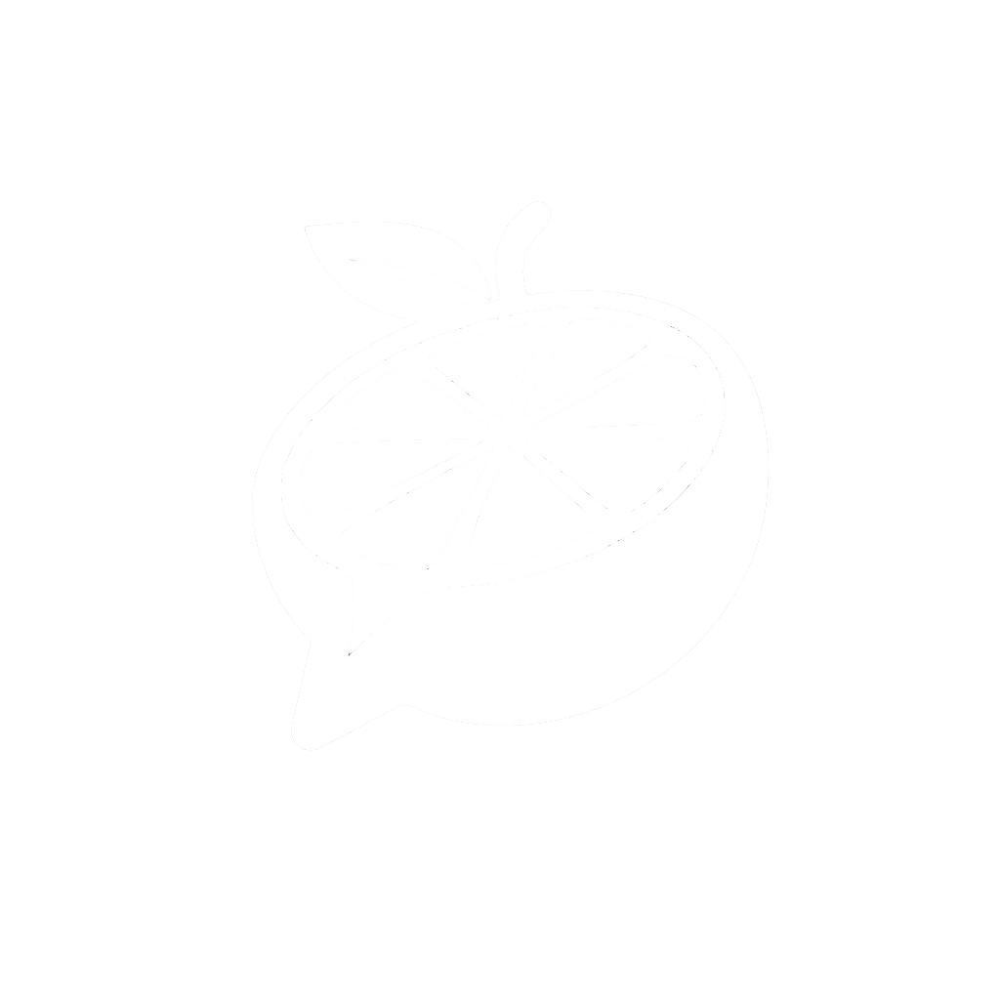

# LemonWhisper



LemonWhisper is a local-first macOS menu bar dictation app.

It lets you record from anywhere, transcribe speech on-device with local models, and send the result back into the app you were using before you started recording.

## What It Does

- Runs as a menu bar app instead of a full dock app.
- Start/Stop recording audio with `Ctrl+Y`.
- Cancel an in-progress recording with a double-tap of `Control`.
- Transcribes locally with either Whisper or Voxtral.
- Downloads and manages models inside the app (Voxtral Mini 3B 4-bit recommended).
- Switches between downloaded models without external scripts.
- Shows lightweight recording and transcription HUDs near the cursor.
- Saves recent transcriptions locally and lets you copy, delete or export them.
- Auto-pastes the transcript back into the field you started recording from.

## Requirements

- macOS 15.5 or newer
- Apple Silicon is recommended

## Getting Started

### 1. Download the latest release

Download the latest `.dmg` from [GitHub Releases](https://github.com/JeffryCA/lemon-whisper/releases/latest).

### 2. Install LemonWhisper

- Open the DMG
- Drag `LemonWhisper.app` into `Applications`
- Launch LemonWhisper from `Applications`

### 3. Grant permissions on first launch

- Microphone access, so the app can record audio
- Accessibility access, so the app can paste text back into other apps

## Development

If you want to work on the app locally:

```bash
git clone https://github.com/JeffryCA/lemon-whisper.git
cd lemon-whisper
open LemonWhisper/LemonWhisper.xcodeproj
```

Xcode will resolve Swift Package Manager dependencies automatically. Then run the `LemonWhisper` scheme on `My Mac`.

## Local Storage

LemonWhisper stores app data under:

```text
~/Library/Application Support/LemonWhisper/
```

Your data:

- Models: `~/Library/Application Support/LemonWhisper/models/`
- History database: `~/Library/Application Support/LemonWhisper/Transcriptions.sqlite`

## Credits

LemonWhisper builds on open-source work from several projects and contributors:

- [whisper.cpp](https://github.com/ggerganov/whisper.cpp) by Georgi Gerganov and contributors, which powers the local Whisper backend used by this app.
- [mlx-voxtral-swift](https://github.com/VincentGourbin/mlx-voxtral-swift) by Vincent Gourbin and contributors, which powers the local Voxtral backend integration.
